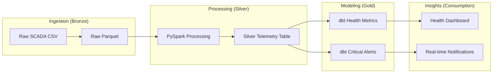
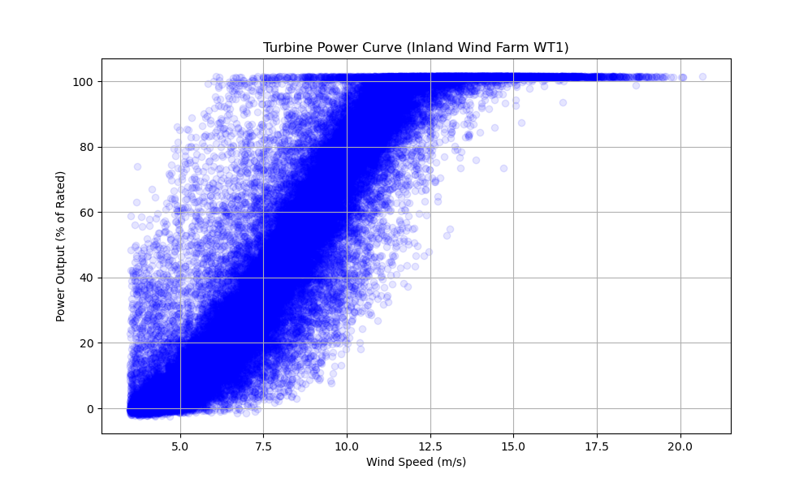
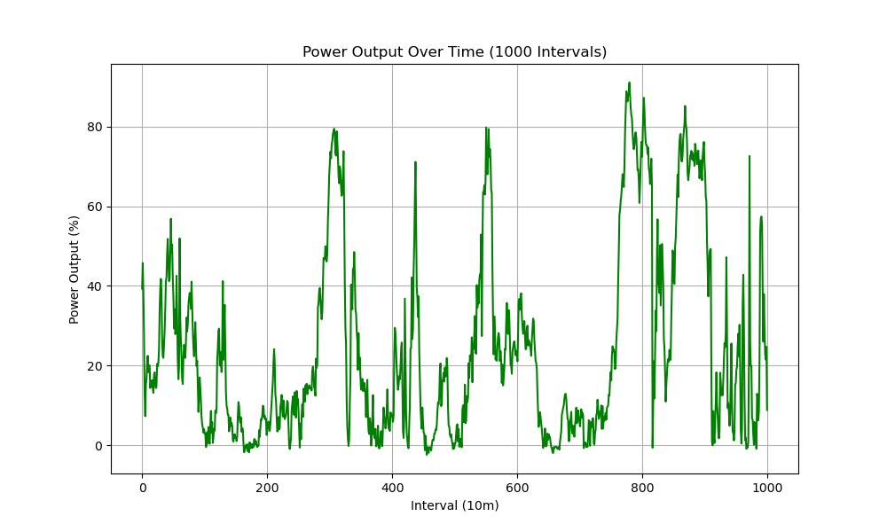

# Wind Turbine Predictive Maintenance Pipeline

This project implements a scalable data pipeline for monitoring wind turbine health using IoT SCADA data, leveraging a **Medallion Architecture** to ensure data quality and reliability.

## 🏗️ Architecture Overview

The pipeline follows the **Medallion Architecture** to transform raw sensor telemetry into actionable business insights.



### Data Layers
1.  **Bronze (Raw):**
    *   Ingests raw SCADA IoT files (now using the **Inland Wind Farm WT1** dataset).
    *   Preserves full history for auditing.

2.  **Silver (Cleaned & Augmented):**
    *   **PySpark ETL:** Handles missing values and synthesizes bearing temperatures based on power output.
    *   **Normalization:** Maps heterogeneous source schemas into a unified telemetry standard.

3.  **Gold (Aggregated & Business-Ready):**
    *   **Predictive Maintenance:** Flags turbines where vibration exceeds 2 standard deviations (`gold_turbine_health`).
    *   **Critical Alerts:** Detects sustained overheating (>85°C for 30+ minutes) using window functions (`turbine_alerts`).

## 📊 Visualization & Dashboards

The project includes automated scripts to generate performance insights from the processed telemetry data.

### 📈 Dashboard Insights
-   **Turbine Power Curve:** Visualizes `wind_speed` vs. `power_output`. This is a critical diagnostic for performance health.
    
    

-   **Power Output Stability:** Tracks production over time to monitor operational consistency.
    
    

-   **Vibration Anomaly Detection:** Identifies abnormal mechanical wear before component failure.

> **Tip:** You can use the `notebooks/` directory to run exploratory visualizations using Seaborn or Plotly.

## 🚀 Getting Started

### 1. Prerequisites
-   Python 3.8+
-   PySpark
-   dbt-core

### 2. Installation
```bash
pip install -r requirements.txt
```

### 3. Execution
```bash
# Process raw data into Silver layer
python scripts/edp_processing.py

# Build Gold layer with dbt
dbt run
dbt test
```

## 📂 Project Structure

- `/data`: Storage for raw (Bronze), silver, and gold datasets.
- `/scripts`: PySpark ETL scripts for data ingestion and mapping.
- `/dbt`: SQL models for business logic, health scoring, and alerts.
- `/airflow_dags`: Workflow definitions for pipeline orchestration.
- `/notebooks`: Exploratory Data Analysis and visualization prototypes.
